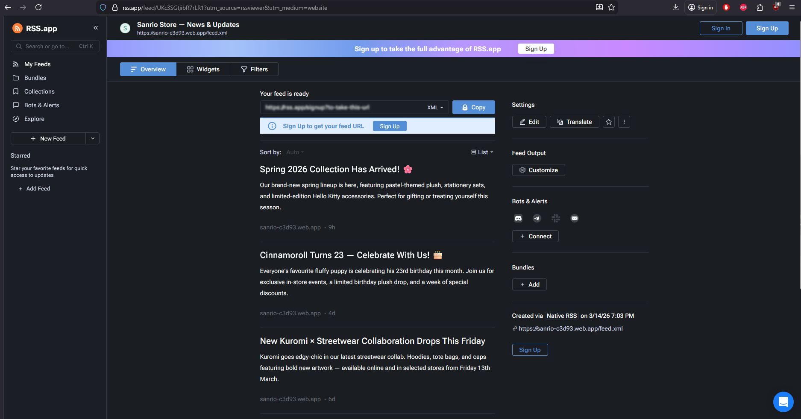

# ★ Sanrio Friends Fan Store

A responsive, multi-page fan web application celebrating the world of Sanrio. Browse beloved characters, manage them with a full CRUD interface, explore a categorised product catalogue backed by Firebase with import and export support, manage news and updates, and get in touch through an interactive contact page — all wrapped in a cute-but-professional pastel aesthetic.

> **Disclaimer:** This is a fan-made, non-commercial project created for educational purposes. All Sanrio characters, names, and artwork are the intellectual property of [Sanrio Co., Ltd.](https://www.sanrio.com/) This project is not affiliated with, endorsed by, or connected to Sanrio in any way.

---

## 🌐 Live Site

**[https://sanrio-c3d93.web.app](https://sanrio-c3d93.web.app)**

---

## ✦ Pages

| Route | Description |
|---|---|
| `/` | Home — Hero banner, character carousel, and product grid with import/export |
| `/characters` | Full character gallery with live search, category filtering, and CRUD |
| `/news` | News & Updates — RSS reader with full CRUD (Create, Read, Update, Delete) |
| `/contact` | Contact form with Firebase persistence and an interactive map |
| `/terms-of-service` | Terms of Service |
| `/privacy-policy` | Privacy Policy |

---

## ♡ Features

- **Character Carousel** — Swiper-powered showcase reading from a static JSON data file
- **Character CRUD** — Full Create, Read, Update, and Delete for characters, persisted locally in `localStorage` and seeded from `characters.json`
- **Product Catalogue** — Firebase Realtime Database–backed grid with client-side category filtering and loading skeletons
- **Product Import** — Upload `.json`, `.csv`, or `.xml` files via a native OS file picker to add products directly into Firebase
- **Product Export** — Download the current catalogue as `.json`, `.csv`, or `.xml` via a native OS save dialog
- **News & Updates (CRUD)** — Full Create, Read, Update, and Delete for news items stored in Firebase Realtime Database, with animated card list and modal forms
- **RSS Feed** — Valid RSS 2.0 feed served at `/feed.xml`, subscribable in any RSS reader; each item links directly to its card on the News page
- **Contact Form** — React Hook Form with validation; submissions are saved to Firebase
- **Interactive Map** — React-Leaflet map centred on Sanrio HQ in Tokyo
- **Centralised Firebase Access** — All Firebase operations are routed through `src/services/`
- **Responsive Layout** — Mobile-first, flexbox throughout; hamburger drawer navigation on small screens
- **Animated UI** — Entrance animations and micro-interactions via Framer Motion
- **Firebase Hosting** — Deployed and served via Firebase Hosting
- **404 Page** — Custom not-found screen with navigation back to safety

---

## 🛠 Tech Stack

### Core
| Package | Purpose |
|---|---|
| [React 19](https://react.dev/) | UI library |
| [Vite](https://vitejs.dev/) | Build tool and dev server |
| [TypeScript](https://www.typescriptlang.org/) | Static typing |
| [React Router DOM v7](https://reactrouter.com/) | Client-side routing |

### Firebase
| Package | Purpose |
|---|---|
| [Firebase JS SDK](https://firebase.google.com/docs/web/setup) | Realtime Database reads/writes |
| [Firebase Hosting](https://firebase.google.com/docs/hosting) | Production deployment |

### Third-Party UI Components
| Package | Purpose |
|---|---|
| [Swiper.js](https://swiperjs.com/) | Touch-friendly character carousel |
| [React-Leaflet](https://react-leaflet.js.org/) + [Leaflet](https://leafletjs.com/) | Interactive map on the contact page |
| [Framer Motion](https://www.framer.com/motion/) | Page entrance animations and transitions |
| [React Hook Form](https://react-hook-form.com/) | Contact and news item form state and validation |
| [React Icons](https://react-icons.github.io/react-icons/) | UI icons throughout (Feather set) |
| [show-open-file-picker](https://www.npmjs.com/package/show-open-file-picker) | Native OS file picker and save dialog for import/export |
| [PapaParse](https://www.papaparse.com/) | Robust CSV parsing for product import |

### Fonts
| Font | Usage | Source |
|---|---|---|
| [Baloo 2](https://fonts.google.com/specimen/Baloo+2) | Headings, logo, buttons | Google Fonts |
| [Nunito](https://fonts.google.com/specimen/Nunito) | Body text | Google Fonts |

### Map Tiles
Map tiles are provided by [OpenStreetMap](https://www.openstreetmap.org/) contributors under the [Open Database Licence (ODbL)](https://opendatacommons.org/licenses/odbl/). Attribution is displayed automatically by Leaflet.

---

## 🗂 Project Structure

```
src/
├── components/
│   ├── category-filter/   # Product category pill buttons
│   ├── character-card/    # Reusable character card with CRUD action buttons
│   ├── character-carousel/# Swiper carousel reading from characters.json
│   ├── contact-form/      # React Hook Form — calls contact.service
│   ├── footer/            # Site footer with social links and legal nav
│   ├── header/            # Sticky header with responsive hamburger menu
│   ├── hero/              # Home page hero banner with animations
│   ├── layout/            # Layout wrapper (Header + Outlet + Footer)
│   ├── map-embed/         # React-Leaflet map component
│   ├── product-card/      # Individual product card with badge support
│   └── product-grid/      # Firebase-backed grid + import/export toolbar
├── data/
│   └── characters.json    # Default character data (seed for localStorage)
├── firebase/
│   └── firebase-config.ts # Firebase app initialisation (config only)
├── hooks/
│   ├── use-characters.ts  # localStorage-backed CRUD hook for characters
│   ├── use-products.ts    # Fetches and filters products via products.service
│   └── use-news.ts        # Full CRUD for news items via news.service
├── pages/
│   ├── characters/        # Character gallery with search, filter, and CRUD
│   ├── contact/           # Contact form + map layout
│   ├── home/              # Home page composition
│   ├── legal/             # Shared Terms of Service / Privacy Policy page
│   ├── news/              # News & Updates page with CRUD and RSS reader
│   └── not-found/         # 404 page
├── router/
│   ├── app-router.tsx     # Route definitions
│   └── routes.ts          # Centralised route path constants
├── services/              # ← All Firebase access is centralised here
│   ├── products-service.ts# fetchProducts, createProduct, deleteProduct
│   ├── news-service.ts    # fetchNewsItems, createNewsItem, updateNewsItem, deleteNewsItem
│   └── contact-service.ts # saveContactMessage
├── styles/
│   ├── variables.css      # Design tokens (colours, spacing, typography…)
│   └── global.css         # Reset, shared utilities, and animations
├── types/
│   ├── character.ts       # Character and CharacterCategory types
│   ├── product.ts         # Product and ProductCategory types
│   └── news.ts            # NewsItem and NewsItemPayload types
└── utils/
    ├── file-export.ts           # Generic native save dialog (JSON/CSV/XML)
    ├── file-import.ts           # Generic native file picker + parser (JSON/CSV/XML)
    └── product-import-export.ts # Product-specific import/export mapping

public/
├── datos.json   # Example product import file (JSON)
├── datos.csv    # Example product import file (CSV)
├── datos.xml    # Example product import file (XML)
├── feed.xml     # Static RSS 2.0 feed (updated manually on deploy)
└── feed.xsl     # XSLT stylesheet for styled browser RSS view
```

---

## 📦 Import & Export

The product catalogue supports importing and exporting data in three formats directly from the home page product grid toolbar.

### Import
Click **"Choose file"** to open a native OS file picker filtered to `.json`, `.csv`, and `.xml`. Each product in the file is saved to Firebase Realtime Database and appears in the grid immediately.

### Export
Click **JSON**, **CSV**, or **XML** to open a native OS "Save As" dialog and download the current catalogue in that format. The file reflects all products currently in Firebase.

### Example import files

Download and use these files to test the import functionality:

| Format | Link | Description |
|--------|------|-------------|
| JSON | [datos.json](https://sanrio-c3d93.web.app/datos.json) | Array of product objects |
| CSV  | [datos.csv](https://sanrio-c3d93.web.app/datos.csv)   | Comma-separated, tags pipe-separated (`\|`) |
| XML  | [datos.xml](https://sanrio-c3d93.web.app/datos.xml)   | `<products>` root with `<product>` children |

### File format reference

**JSON** — array of objects; `id` and `createdAt` are auto-generated on import:
```json
[
  {
    "name": "Hello Kitty Plush",
    "description": "A soft plush…",
    "imageUrl": "https://…",
    "price": 19.99,
    "category": "plush",
    "isFeatured": false,
    "isNew": true,
    "tags": ["hello-kitty", "plush"]
  }
]
```

**CSV** — header row required; tags separated by `|`:
```
name,description,imageUrl,price,category,isFeatured,isNew,tags
Hello Kitty Plush,A soft plush…,https://…,19.99,plush,false,true,hello-kitty|plush
```

**XML** — `<products>` root, each product in a `<product>` element:
```xml
<?xml version="1.0" encoding="UTF-8"?>
<products>
  <product>
    <name>Hello Kitty Plush</name>
    <description>A soft plush…</description>
    <imageUrl>https://…</imageUrl>
    <price>19.99</price>
    <category>plush</category>
    <isFeatured>false</isFeatured>
    <isNew>true</isNew>
    <tags><tag>hello-kitty</tag><tag>plush</tag></tags>
  </product>
</products>
```

Valid `category` values: `stationery`, `plush`, `accessories`, `apparel`, `home`.

> ⚠️ Import/export uses the [File System Access API](https://developer.mozilla.org/en-US/docs/Web/API/File_System_Access_API) — supported in Chrome and Edge. Not supported in Firefox.

---

## 🔥 Firebase Services Architecture

All Firebase Realtime Database access is centralised in `src/services/`. No component or hook imports directly from `firebase/database` — they all go through the service layer.

```
Component / Hook
      │
      ▼
 src/services/
 ├── products.service.ts   (fetchProducts, createProduct, deleteProduct)
 ├── news.service.ts       (fetchNewsItems, createNewsItem, updateNewsItem, deleteNewsItem)
 └── contact.service.ts    (saveContactMessage)
      │
      ▼
 src/firebase/firebase-config.ts   (db instance only)
      │
      ▼
 Firebase Realtime Database
```

---

## 🧑‍🎤 Characters CRUD

Character data is stored **locally in `localStorage`** and seeded from `src/data/characters.json` on first load. No Firebase required — all changes persist in the user's browser.

| Operation | How |
|---|---|
| **Create** | "Add Character" button → modal form → saved to `localStorage` |
| **Read** | Loaded from `localStorage` (falls back to `characters.json` on first visit) |
| **Update** | ✏️ edit button on card hover → pre-filled modal → updates `localStorage` |
| **Delete** | 🗑 delete button on card hover → confirm dialog → removed from `localStorage` |
| **Reset** | "Reset" button → restores original `characters.json` defaults |

> ⚠️ Character changes are browser-local — they will not appear on other devices or for other users.

---

## 📰 News & RSS

### CRUD Interface
The `/news` page provides a full Create, Read, Update, Delete interface for news items stored in Firebase Realtime Database:

| Operation | How |
|---|---|
| **Create** | "Add Update" button → modal form → saved to Firebase |
| **Read** | Items fetched on page load, sorted newest first, rendered as animated cards |
| **Update** | ✏️ edit button on each card → pre-filled modal → updates Firebase |
| **Delete** | 🗑 delete button on each card → confirm dialog → removed from Firebase |

### NewsItem data shape
```ts
{
  id:          string;   // Firebase push key
  title:       string;
  description: string;
  url:         string;   // Points to /news#<id> for anchor scrolling
  author:      string;
  pubDate:     string;   // ISO 8601, set on creation
}
```

### RSS Feed
A valid RSS 2.0 file is served at:

```
https://sanrio-c3d93.web.app/feed.xml
```

Paste this URL into any RSS reader (Feedly, NetNewsWire, etc.) to subscribe. Each RSS item links directly to its corresponding card on the `/news` page (`/news#news-001` etc.), so clicking an item in your RSS reader scrolls you to that update on the site.

> **Note:** `feed.xml` is a static file updated manually at deploy time. To sync it with the latest database content, export the current news items from Firebase and regenerate the file before running `npm run build && firebase deploy`.

---

## 🚀 Getting Started

### Prerequisites
- Node.js 18+
- A Firebase project with **Realtime Database** and **Hosting** enabled

### Installation

```bash
# Clone the repository
git clone https://github.com/danielrodriguezyim/sanrio-app.git
cd sanrio-app

# Install dependencies
npm install
```

### Environment Variables

Rename `.env.example` to `.env` and fill in your Firebase project credentials:

```
VITE_FIREBASE_API_KEY=your_api_key
VITE_FIREBASE_AUTH_DOMAIN=your_project.firebaseapp.com
VITE_FIREBASE_DATABASE_URL=https://your_project-default-rtdb.region.firebasedatabase.app
VITE_FIREBASE_PROJECT_ID=your_project_id
VITE_FIREBASE_STORAGE_BUCKET=your_project.firebasestorage.app
VITE_FIREBASE_MESSAGING_SENDER_ID=your_sender_id
VITE_FIREBASE_APP_ID=your_app_id
```

> Vite will not hot-reload `.env` changes — restart the dev server after creating or editing the file.

### Firebase Database Rules

In the Firebase console under **Realtime Database → Rules**, set:

```json
{
  "rules": {
    "products": {
      ".read": true,
      ".write": true
    },
    "contact-messages": {
      ".read": false,
      ".write": true
    },
    "news-items": {
      ".read": true,
      ".write": true
    }
  }
}
```

> ⚠️ `products` requires `.write: true` to support the import feature. Restrict to authenticated users in production.
> ⚠️ `news-items` rules are open for demonstration purposes. Restrict `.write` to authenticated admin users in production.

### Seed the Database

Import `database-merged.json` from the Firebase console:
**Realtime Database → ⋮ menu → Import JSON**

This seeds both the product catalogue and the initial news items.

### Run Locally

```bash
npm run dev
```

The app will be available at `http://localhost:5173`.

### Build for Production

```bash
npm run build
```

### Deploy to Firebase

```bash
npm run build && firebase deploy
```

---

## 🎨 Design Decisions

- **Colour palette** — Built around Sanrio's iconic pastel pinks with lavender and peach accents, defined entirely through CSS custom properties in `variables.css` for consistency and easy theming.
- **Typography** — Baloo 2 (rounded, friendly) for headings and Nunito (clean, legible) for body text — both chosen to reflect the brand's playful-but-approachable personality.
- **Mobile-first** — Base styles target small screens; `min-width` media queries progressively enhance the layout upward.
- **No CSS Grid** — All layouts are built exclusively with flexbox as a project constraint.
- **Client-side filtering** — Product category filtering is handled in memory via `useMemo` rather than per-filter database queries, eliminating the need for composite indexes and reducing read costs.
- **Shared modal pattern** — The news Create and Edit operations share a single `NewsModal` component driven by a `mode` prop, keeping form logic DRY and consistent.
- **Centralised Firebase access** — All database calls go through `src/services/`, keeping Firebase logic decoupled from UI components and making the service layer independently testable.
- **Layered import/export** — Generic file I/O utilities (`file-import.ts`, `file-export.ts`) are kept separate from product-specific mapping (`product-import-export.ts`), following the single responsibility principle.

---

## 📚 Resources & Inspiration

### Official References
- [Sanrio Official Website](https://www.sanrio.com/) — Character descriptions and brand reference
- [Sanrio Characters](https://www.sanrio.com/pages/characters) — Official character roster

### Documentation
- [React Docs](https://react.dev/reference/react)
- [Vite Docs](https://vitejs.dev/guide/)
- [Firebase Realtime Database Docs](https://firebase.google.com/docs/database/web/start)
- [Firebase Hosting Docs](https://firebase.google.com/docs/hosting)
- [React Router Docs](https://reactrouter.com/en/main)
- [Swiper.js React Components](https://swiperjs.com/react)
- [React-Leaflet Docs](https://react-leaflet.js.org/docs/start-introduction/)
- [Framer Motion Docs](https://www.framer.com/motion/)
- [React Hook Form Docs](https://react-hook-form.com/get-started)
- [RSS 2.0 Specification](https://www.rssboard.org/rss-specification)
- [File System Access API](https://developer.mozilla.org/en-US/docs/Web/API/File_System_Access_API)
- [PapaParse Docs](https://www.papaparse.com/docs)

### Design Inspiration
- [Dribbble — Kawaii UI](https://dribbble.com/search/kawaii-ui) — Pastel interface exploration
- [Sanrio on Pinterest](https://www.pinterest.com/sanrio/) — Official brand imagery and colour references
- [Google Fonts — Baloo 2](https://fonts.google.com/specimen/Baloo+2) — Rounded display typeface
- [CSS-Tricks — A Complete Guide to Flexbox](https://css-tricks.com/snippets/css/a-guide-to-flexbox/) — Flexbox reference

---

## 📝 Naming Conventions

| Context | Convention | Example |
|---|---|---|
| Folders | kebab-case | `character-card/` |
| TSX / CSS files | PascalCase | `CharacterCard.tsx` |
| TS utility/service files | kebab-case | `products.service.ts`, `file-export.ts` |
| CSS classes / IDs | kebab-case | `.character-card__name` |
| Variables / functions | camelCase | `fetchProducts` |
| Booleans | is / has / should prefix | `isLoading`, `hasError` |
| Routes | kebab-case | `/characters`, `/news` |
| Types / Interfaces | PascalCase | `Product`, `NewsItem` |

---

## 📡 RSS Feed — Proof of Implementation

The RSS 2.0 feed is live and accessible at [`/feed.xml`](https://sanrio-c3d93.web.app/feed.xml). When opened in a browser, an XSLT stylesheet renders it as a fully styled page matching the site's aesthetic. RSS readers consume the same URL as a standard feed.

### Browser view (`/feed.xml`)



> Each item in the feed links directly to its corresponding card on the [`/news`](https://sanrio-c3d93.web.app/news) page via anchor URLs (e.g. `/news#news-001`).

---

*Made with ♡.*
